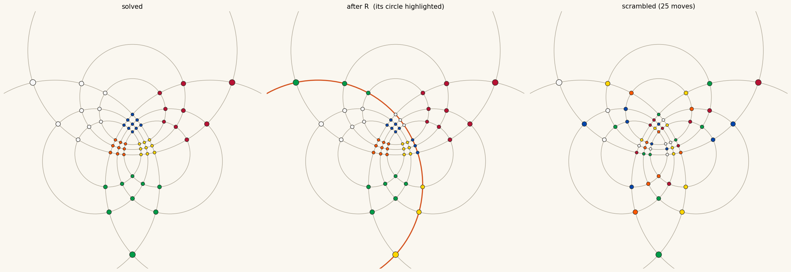

# Rubik’s Cube Represented in 9 Intersecting Circles

A Rubik's cube modeled as **nine circles** rather than six faces, with a two-phase solver
that answers any scramble in 20 turns or fewer, and a web app that shows the cube and the
circle diagram turning together.

Live at [rubik.steeplelabs.com](https://rubik.steeplelabs.com).



## The model

Three axes, three parallel layers on each, so **nine circles**. Each circle carries
**4 groups of 3 nodes**, and a quarter turn rotates the whole ring by one group.

Every sticker lies on exactly **two** circles — the two axes other than its own face
normal — which is why the picture is a rosette of intersections: 9 circles x 12 nodes =
108 incidences = 54 stickers x 2.

The geometry is the single source of truth. A node is a `(cubie position, outward normal)`
pair in `{-1,0,1}^3`; a move rotates every cubie in one layer and carries its stickers
along. Facelet strings, cubie-level permutations and the diagram's layout are all derived
from that, so they cannot drift apart.

Two properties are checked rather than assumed (`python renderer.py --selftest`):

- every node lands on both of its circles, to `2.7e-15`
- **every quarter turn is exactly a 3-step rotation** along its circle's 12-node ring

The second is the real content of the model: the circles aren't decoration, they are the
cycles the puzzle actually moves things along.

## Quick start

Needs `numpy`; the renderer also needs `matplotlib`.

```python
import cube as C, solver

state = C.apply_moves(C.SOLVED, C.scramble(25, seed=1))
sol = solver.solve(state)          # first run builds pruning tables (~7s, then cached)
print(len(sol), " ".join(sol))     # 20 D L B D' F2 L F' B U' B' U2 R2 B2 L2 D' B2 L2 U B2 D'
print(solver.verify(state, sol))   # True
```

Batch benchmark, verifying every solution:

```
python demo.py 100        # 100 scrambles, solved and verified
python renderer.py        # writes cube_circles.png
python build_standalone.py
```

## The solver

Two-phase (Kociemba). Phase 1 drives the cube into `G1 = <U,D,R2,L2,F2,B2>` — corners
untwisted, edges unflipped, middle-slice edges back in the slice. Phase 2 solves it inside
`G1`. Both are IDA* guided by four pruning tables built by breadth-first search, cached in
`tables.npz` (2.4 MB).

**G1 is defined relative to the U/D axis**, so a cube can simply have no short two-phase
solution in the default frame. The search therefore runs **three axis frames and the
inverse cube**, interleaved by depth. This is not an optimisation detail — without it, 2 of
100 random scrambles find nothing at all within 20 moves.

Measured over 100 random 25-move scrambles, every solution verified:

| | |
|---|---|
| solved within 20 turns | **100/100** |
| lengths | 81 x 20, 17 x 19, 2 x 18 |
| median solve time | 0.12 s |
| slowest | 14.1 s |

The **superflip** — the position that genuinely requires all 20 — comes out at exactly 20,
and takes minutes precisely because nothing shorter exists.

### What this does and does not show

It demonstrates the 20-move bound; it does not prove it. Solutions cluster at exactly 20
because the search returns the first sequence that fits the budget, and pushing below 20
costs disproportionately more time. Proving that *no* shorter solution exists for even one
position needs an optimal solver, and proving 20 for all 4.3x10^19 positions is the 2010
coset computation (Rokicki et al., ~35 CPU-years) — not something reachable here.

## The web app

`app.html` is the source; `index.html` is the standalone build. Both panels are driven by
the same move, and the geometry is exported from `renderer.py` rather than re-derived, so
the diagram matches the verified model exactly.

- **Cube** — CSS-3D, drag to orbit, the layer physically swings
- **Circles** — the turning circle lights up and its nodes travel *along* it
- **Axis mode** — standard notation turns each face clockwise as seen from outside, so
  `L`/`M`/`D`/`E`/`B` visually oppose their axis. This toggle makes every circle on an axis
  spin the same way by sending the inverse move; history stays in standard notation
- **Solver in the browser** — the same two-phase search ported to JS. Tables build in
  ~460 ms (15x faster than the numpy version), then solves land in 2–360 ms
- **Superflip** — loads the hardest position with its known 20-move solution

## Files

| file | role |
|---|---|
| `cube.py` | geometry, the 9 circles, moves, whole-cube rotations |
| `cubie.py` | piece-level view derived from the same geometry |
| `solver.py` | two-phase solver, pruning tables, multi-frame search |
| `renderer.py` | the circle diagram (`--selftest` checks the layout) |
| `demo.py` | batch benchmark over random scrambles |
| `app.html` | web app, artifact format (no `<html>`/`<head>` wrapper) |
| `index.html` | standalone build — open from disk or host anywhere |
| `build_standalone.py` | regenerates `index.html` from `app.html` |
| `app_geometry.json` | geometry exported for the browser |
| `tables.npz` | cached pruning tables, rebuilt automatically if deleted |

## Deployment

`index.html` is fully self-contained — solver, tables and geometry all run in the browser,
so there is no backend. The only external request is the Google Fonts stylesheet, and it
falls back to system fonts without one.

It is served by the `rubik-web` container on port **8098**
(`steeplelabs/deploy/docker-compose.sites.yml`), which the public web server proxies for
`rubik.steeplelabs.com`. To publish a change:

```
python build_standalone.py
cp index.html ../../steeplelabs/deploy/sites/rubik/
```

nginx reads from disk per request, so no restart is needed.
